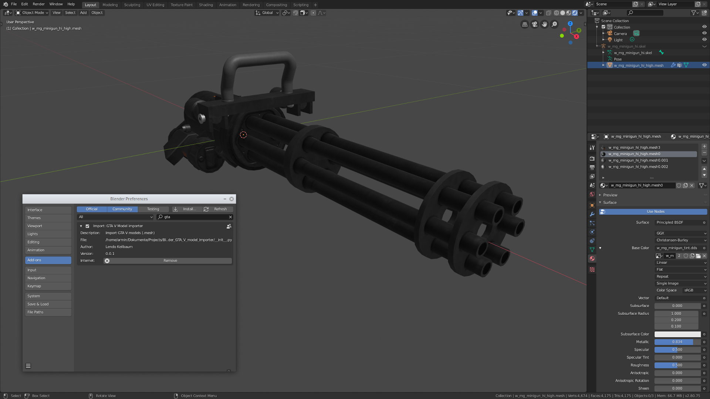
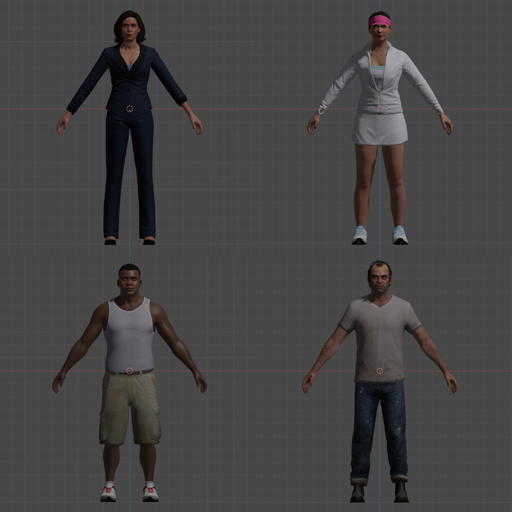

# Blender GTA V model importer
import GTA V models to Blender

## Mesh import:
* UV coordinates
* bone weights
* custom normals
* armature
* textures
* vertext colors
* LODs

## How to use:
* save addon in addon folder and enable it
* go to: File->Import->"Import GTA V models (.odr, .odd)"

#### Video:
https://open.lbry.com/@LendoKe:9/gta_v_blender_importer
